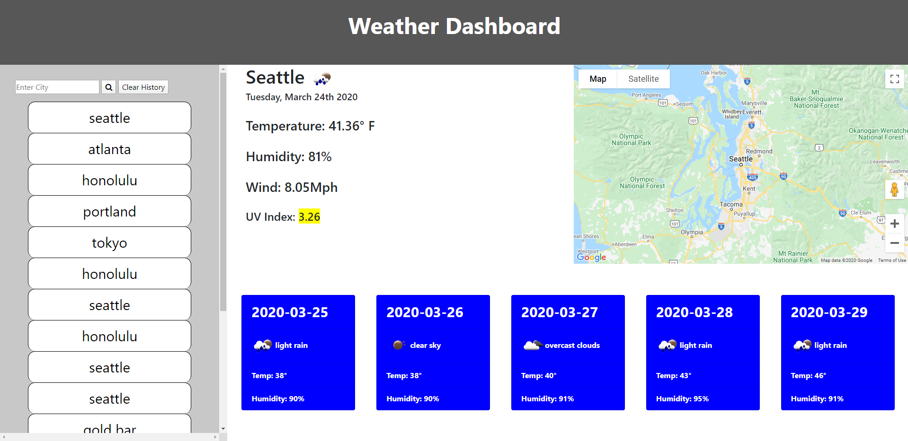

# Weather Dashboard

## UW Bootcamp Week 3 Due 3/24/2020

Enter a city name into the search bar and the Weather Dashboard will load the current weather as well as a five-day forecast.  The current UV index is listed and color-coded so the user can easily prepare and protect against harmful UV rays. 

The dashboard remembers your search history, and any previously searched city can be re-visited by clicking the corresponding button in the search history.  Additionally, the weather for the most recently searched city will always be displayed on initial page load. 

An overview map of the searched city also appears, which allows the user to seach the city for weather-friendly activities!

View the project [here](https://the-medium-place.github.io/weather-dashboard/).

## The Script

* The `displayWeather()` function does the bulk of the work for this page, including all 3 `$.ajax` requests.
    
    * The first `$.ajax` request retrieves the following information:
        * Current city Latitude and Longitude (used in Google Maps retrieval)
        * City name
        * Temperature
        * Humidity
        * Wind speed

    * An `$.ajax` sub-request pulls the 5-day forecast for the searched City
        * This info is used to dynamically build the cards housing the forecast.

    * A second sub-request finds the UV index and displays it on the page. This value is colorized for UV warning levels.

* The `renderButtons()` function is used to dynamically create all of the search history buttons on the left column of the dashboard. 
    * A `for` loop cycles throught `searchList` array and creates a button for each item within

## Links

* [Bootstrap CSS](https://getbootstrap.com)
* [Font Awesome](https://fontawesome.com)
* [Moment.js](https://momentjs.com)

## APIs

* [OpenWeather Map](https://openweathermap.org/api)
* [Google Maps API](https://maps.googleapis.com)

Thank You! -ZGS